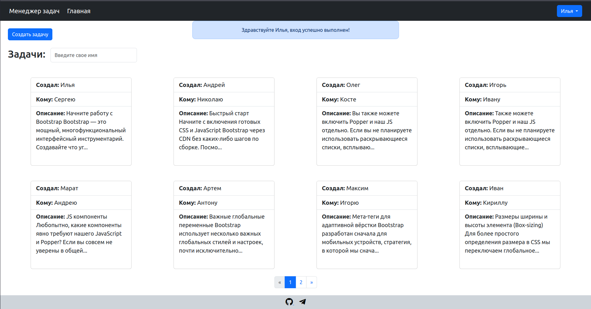

<p align="center"><a href="https://laravel.com" target="_blank"></a></p>

<p align="center">
<a href="https://github.com/laravel/framework/actions"></a>
<a href="https://packagist.org/packages/laravel/framework"></a>
<a href="https://packagist.org/packages/laravel/framework"></a>
<a href="https://packagist.org/packages/laravel/framework"></a>
</p>


**Task Manager** — это веб-приложение на Laravel, предназначенное для управления задачами с функционалом регистрации и аутентификации пользователей.




## Функционал

- Регистрация и аутентификация: Защита данных, индивидуальный доступ.
- Управление задачами с пагинацией (аутентифицированные пользователи): Создание, редактирование и удаление задач с динамическим обновлением через JavaScript и jQuery.
- Просмотр задач (неаутентифицированные пользователи): Ограниченный доступ только для просмотра.
- Живой поиск по задачам: Мгновенный поиск задач по имени адресата без перезагрузки страницы.

## Технологический стек

- PHP 8.2
- Laravel
- MySQL
- jQuery

## Требования к установке

- PHP версия 8.0^
- Composer
- Mysql
- Make

# Руководство по установке и запуску проекта локально.

## Клонирование репозитория

Для начала клонируйте репозиторий:

```shell
git clone <URL_репозитория>
cd <название_клонированной_директории>

Настройка окружения:

Скопируйте пример файла конфигурации окружения в .env и настройте его:

cp .env.example .env

Затем откройте файл .env в редакторе и настройте параметры подключения к базе данных:

DB_CONNECTION=mysql
DB_HOST=127.0.0.1
DB_PORT=3306
DB_DATABASE=имя_базы_данных
DB_USERNAME=имя_пользователя
DB_PASSWORD=пароль

Установите зависимости проекта с помощью Composer:

make install

Генерация ключа приложения:

Генерация ключа:

make generate key

Ключ будет автоматически добавлен в файл .env.

Создайте необходимые таблицы в вашей базе данных, выполнив миграции:

make migrate

Запустите локальный сервер для разработки:

make start

Теперь ваше приложение доступно по адресу http://127.0.0.1:8000.

Приятной работы!
